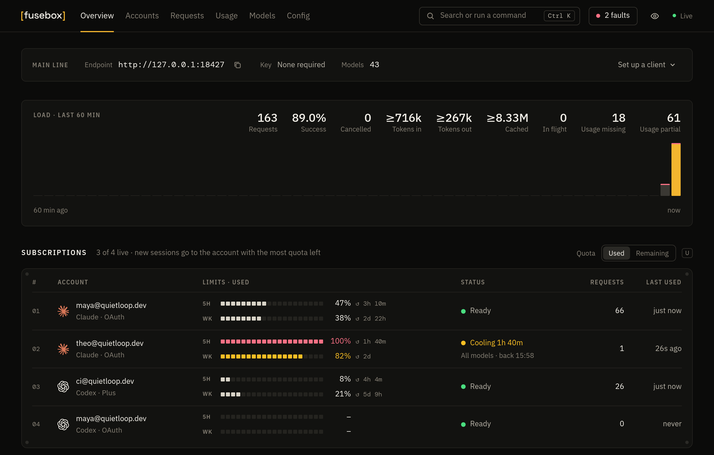
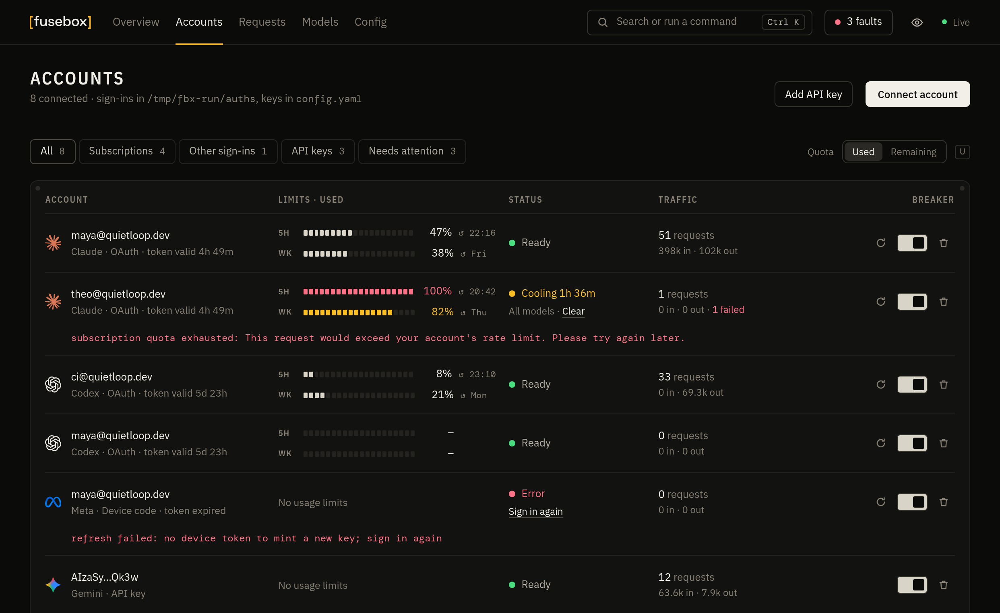
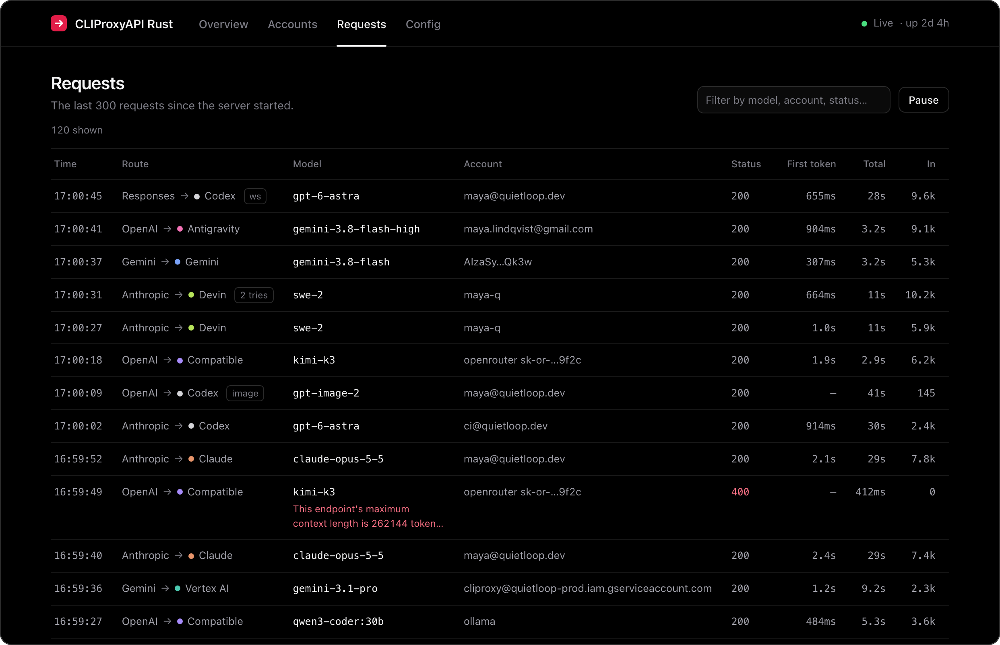
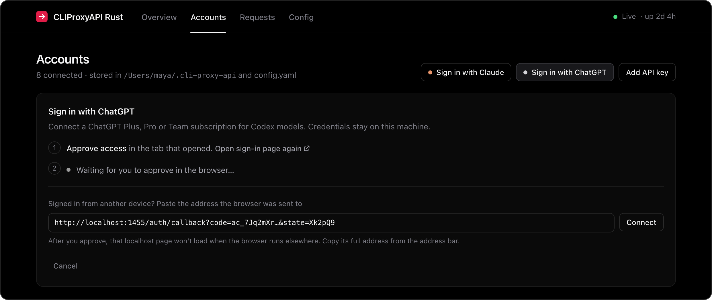

<div align="center">

<h1><picture><source media="(prefers-color-scheme: dark)" srcset="assets/fusebox-wordmark.svg"></picture></h1>

**All your AI subscriptions. One fast API.**

A single Rust binary that exposes OpenAI, Anthropic and Gemini compatible endpoints, backed by the accounts you already pay for:<br>
Claude, ChatGPT, Gemini, Antigravity, Grok, Kimi, Meta, Devin and Vertex AI.<br>
Point Claude Code, Codex, your editor or any SDK at one URL and stop caring which account answers.

[](https://github.com/DigitalPals/Fusebox/actions/workflows/ci.yml)
[](LICENSE)
[](https://www.rust-lang.org)
[](https://github.com/DigitalPals/Fusebox/releases/latest)
[](#the-dashboard)

[Quick start](#quick-start) · [Coming from CLIProxyAPI](#coming-from-cliproxyapi) · [Connect your tools](#connect-your-tools) · [Dashboard](#the-dashboard) · [Usage and costs](#usage-and-costs) · [Configuration](#configuration) · [FAQ](#faq)

</div>

<br>



<br>

## Why Fusebox

- **One small binary.** The dashboard and SQLite storage ship inside one executable. No Docker, no Node, no runtime to install.
- **Any model from any tool.** Use GPT inside Claude Code, Claude inside Codex, or Gemini behind the OpenAI SDK. Requests are translated between formats automatically. When the client and the provider already speak the same format, the request passes through untouched.
- **Ten providers.** Subscription sign-in for Claude, ChatGPT (Codex), Antigravity, Grok, Kimi, Meta and Devin; service accounts for Vertex AI; API keys for Anthropic, OpenAI, Gemini, Vertex, Kimi, xAI, Meta and anything OpenAI-compatible.
- **Images and video too.** `/v1/images/generations` and `/v1/images/edits` work with ChatGPT accounts, OpenAI and xAI keys, Vertex Imagen and Gemini image models. xAI video generation is behind `/v1/videos`.
- **WebSockets.** Codex WebSocket sessions are relayed to ChatGPT's own WebSocket upstream, so `previous_response_id` works on the server side. Switch to a Claude or Gemini model mid-session and Fusebox carries the conversation over.
- **Many accounts, no babysitting.** Each new coding session goes to the account with the most quota left, using the 5-hour and weekly usage Claude and ChatGPT report, and stays there so its prompt cache keeps paying off. An account whose limit is used up sits out until it resets, a rate limit cools down only that model on that account, failed requests move to the next account, and OAuth tokens refresh themselves.
- **A dashboard you'll actually open.** Live over WebSocket: every subscription's 5-hour and weekly limits as segmented meters, what has tripped and why, an hour of load, cooldown timers, sign-in flows, a request log that explains each routing decision, the route order for every model, and a config editor. It works on a phone too.
- **Drop-in for CLIProxyAPI users.** Same credential files, same `config.yaml` (both of its layouts), same Docker paths and flags. Swap the image and keep everything else.

## Quick start

**1. Get the binary.** Download it for macOS, Linux or Windows from [Releases](https://github.com/DigitalPals/Fusebox/releases/latest), or build it with Rust 1.88 or newer:

```sh
cargo install --git https://github.com/DigitalPals/Fusebox
```

Or run it with Docker (for amd64 and arm64):

```sh
touch config.yaml && mkdir -p auths
docker run -d --name fusebox -p 8317:8317 \
  -v ./config.yaml:/CLIProxyAPI/config.yaml -v ./auths:/root/.cli-proxy-api \
  ghcr.io/digitalpals/fusebox
```

**2. Start it.**

```sh
fusebox
```

The first run writes a commented `config.yaml` in the current directory (or wherever `--config` or `FUSEBOX_CONFIG` points) and serves everything on `http://127.0.0.1:8317`. That address is also the dashboard.

**3. Add an account.** Click **Connect account** in the dashboard, or use the terminal:

```sh
fusebox login claude        # Claude Pro / Max
fusebox login codex         # ChatGPT Plus / Pro / Team
fusebox login antigravity   # Google account with Antigravity
fusebox login xai           # SuperGrok / X Premium (shows a code to confirm)
fusebox login kimi          # Kimi Code (shows a code to confirm)
fusebox login meta          # Meta Muse (shows a code to confirm)
fusebox login devin         # Devin / Windsurf
fusebox login vertex --file key.json --location global   # Vertex AI service account
```

API keys (Anthropic, OpenAI, Gemini, Vertex, Kimi, xAI, Meta, OpenRouter, Ollama, …) can be added from the dashboard or in `config.yaml`.

## Coming from CLIProxyAPI

Your config, your sign-ins and your Docker setup carry over as they are.

**Docker.** Keep your `docker-compose.yml`, `config.yaml` and `auths/` folder. Add one line to the `.env` next to the compose file and restart:

```sh
echo "CLI_PROXY_IMAGE=ghcr.io/digitalpals/fusebox:latest" >> .env
docker compose up -d
```

The image uses the same paths (`/CLIProxyAPI/config.yaml`, `/root/.cli-proxy-api`) and port, and `./CLIProxyAPI` still works inside the container. To go back, delete the line.

**Binary.** Point it at your existing file: `fusebox --config /path/to/config.yaml`. CLIProxyAPI's flags work too: `-config`, `-claude-login`, `-codex-login`, `-antigravity-login`, `-kimi-login`, `-xai-login`, `-meta-login`, `-devin-login`, `-vertex-import`, `-no-browser`.

**Check before you switch.** This prints the accounts it found per provider, where it will listen, and any settings it will ignore, without starting the server:

```sh
fusebox --config config.yaml check
```

| From CLIProxyAPI | |
| --- | --- |
| Credential files in `auth-dir` | Read and written in the same format, for every provider |
| `config.yaml` | Both layouts: v8 (`server:`, `access:`, grouped `api-keys:`) and the older flat one |
| Client keys, management key (plain or bcrypt-hashed), `allow-remote`, TLS, proxy, routing strategy, retries | Used as is |
| API keys for Claude, Codex, Gemini, Vertex, xAI, Meta and OpenAI-compatible providers | Used with their `base-url`, `proxy-url` (including `direct`), `headers`, model aliases, `prefix` and `excluded-models` |
| `oauth-model-alias`, `oauth-excluded-models`, per-file `prefix` and `model_aliases` | Used as is |
| Session affinity (`routing.session-affinity` or `session-affinity`) | Supported and on by default, with any routing strategy. See [coding sessions](#coding-sessions-and-prompt-caching). |
| Payload rules, plugins, Redis usage queue, weighted routing, the `/v0/management` API | Not supported. The built-in dashboard replaces the separate management panel. |

Changes made from the dashboard keep your file's layout, YAML comments, and settings this binary doesn't use, so you can switch back at any time. The rare layout that can't be edited in place, such as lists written without indentation, is rewritten instead, and the original is kept as `config.yaml.bak`.

## Connect your tools

**Claude Code**

```sh
export ANTHROPIC_BASE_URL=http://127.0.0.1:8317
export ANTHROPIC_AUTH_TOKEN=<one of your api-keys, or anything if you set none>
claude
```

Want GPT in Claude Code? `export ANTHROPIC_MODEL=gpt-6-astra`.

**Codex** in `~/.codex/config.toml`

```toml
model = "gpt-6-astra"
model_provider = "fusebox"

[model_providers.fusebox]
name = "Fusebox"
base_url = "http://127.0.0.1:8317/v1"
wire_api = "responses"
env_key = "FUSEBOX_KEY"   # only needed if you set api-keys
```

**OpenAI SDK**, or any tool with a custom OpenAI base URL

```python
from openai import OpenAI

client = OpenAI(base_url="http://127.0.0.1:8317/v1", api_key="<key>")
client.chat.completions.create(
    model="claude-sonnet-5-5",
    messages=[{"role": "user", "content": "Hello"}],
)
```

**curl**

```sh
curl http://127.0.0.1:8317/v1/messages \
  -H "x-api-key: <key>" -H "content-type: application/json" \
  -d '{"model": "gemini-3.8-flash", "max_tokens": 512, "messages": [{"role": "user", "content": "Hello"}]}'
```

### Endpoints

| Endpoint | Speaks |
| --- | --- |
| `POST /v1/chat/completions` | OpenAI Chat Completions |
| `POST /v1/responses` · `GET /v1/responses` (WebSocket) | OpenAI Responses |
| `POST /v1/responses/compact` | Responses compaction (ChatGPT, xAI) |
| `POST /backend-api/codex/responses` (+ WebSocket) | Codex's native path |
| `POST /v1/messages` · `POST /v1/messages/count_tokens` | Anthropic Messages |
| `POST /v1beta/models/{model}:generateContent` · `:streamGenerateContent` | Gemini |
| `POST /v1/images/generations` · `POST /v1/images/edits` (JSON or multipart) | OpenAI Images |
| `POST /v1/videos/generations` · `/edits` · `/extensions` · `GET /v1/videos/{id}` | xAI video |
| `POST /v1/completions` | Legacy OpenAI completions |
| `GET /v1/models` · `GET /v1beta/models` | Model lists |

Clients authenticate with `Authorization: Bearer`, `x-api-key`, `x-goog-api-key` or `?key=`.

JSON API requests and multipart image edits support `Content-Encoding: gzip` or `zstd`, as well as uncompressed bodies. Authentication runs before decompression; both compressed and decoded bodies are limited to 256 MiB. Unsupported or stacked encodings return 415, malformed compressed bodies return 400, and oversized bodies return 413. Encoding and JSON validation failures appear in request statistics and logs without a provider attempt.

### Providers

| Provider | Sign-in | Models | Speaks upstream |
| --- | --- | --- | --- |
| Claude | OAuth (Pro / Max) or API key | `claude-*` | Anthropic Messages |
| Codex / ChatGPT | OAuth (Plus / Pro / Team) or OpenAI API key | `gpt-*`, `o*`, `codex-*`, `gpt-image-*` | Responses (+ WebSocket) |
| Gemini | API key | `gemini-*`, `gemma-*` | Gemini |
| Vertex AI | Service account or express API key | `gemini-*`, `imagen-*` | Gemini |
| Antigravity | Google OAuth | Gemini and Claude models such as `gemini-3.8-flash-high`, `claude-opus-4-6-thinking` | Cloud Code (Gemini) |
| Grok (xAI) | Device code (SuperGrok / X Premium) or API key | `grok-*`, `grok-imagine-*` | Responses |
| Kimi | Device code (Kimi Code) or API key | `kimi-*` | Chat, Anthropic or Responses, whichever the client speaks |
| Meta | Device code or API key | `muse-*` | Responses |
| Devin | OAuth (Devin / Windsurf) | Claude, GPT, Gemini, Grok, Kimi, GLM, DeepSeek and SWE models | Connect protobuf |
| OpenAI-compatible | API key or none (OpenRouter, Ollama, LM Studio, vLLM, …) | whatever you list, with optional aliases | Chat Completions |

Model names are forgiving: `gpt-6-1-sol` finds `gpt-6.1-sol`, and `gemini-3-8-flash` finds Antigravity's `gemini-3.8-flash-high` when that's the account you have.

When more than one provider has a model, the vendor's own accounts answer first and Antigravity or Devin take the overflow when those are rate limited. To choose a provider yourself, prefix the model: `antigravity/claude-sonnet-4-6`, `devin/gpt-6-astra`, `vertex/gemini-3.1-pro`.

### Reasoning effort, from the model name

Append an effort level or a token budget to any model:

```text
gpt-6-astra(high)                  effort level
claude-opus-5-5(max)               adaptive thinking at max effort
claude-sonnet-4-5-20250929(16000)  thinking budget in tokens
gemini-2.5-pro(0)                  thinking off
```

### Images

```sh
curl http://127.0.0.1:8317/v1/images/generations \
  -H "authorization: Bearer <key>" -H "content-type: application/json" \
  -d '{"model": "gpt-image-2", "prompt": "a lighthouse at night, film photo", "size": "1536x1024"}'
```

`gpt-image-*` runs on a ChatGPT account through Codex's image tool (or an OpenAI key), `grok-imagine-*` on xAI, `imagen-*` on Vertex, and Gemini image models such as `gemini-3.1-flash-image-preview` on Gemini, Vertex or Antigravity. Image models also work in chat: the picture comes back as an image part in whatever format the client speaks.

## The dashboard

Everything is served from the binary at `/`, with no external requests.

<table>
<tr>
<td width="50%" valign="top"></td>
<td width="50%" valign="top"></td>
</tr>
<tr>
<td valign="top"><b>Accounts:</b> used or remaining 5-hour and weekly quota as segmented meters, token expiry, cooldowns per model, and a breaker for each account: refresh, switch off, remove. Each account has its own page with its hour of load and the coding sessions pinned to it.</td>
<td valign="top"><b>Requests:</b> every request as it happens, showing which client format went to which provider, time to first token and tokens. Click a row to see why it went to that account; click a session to follow it.</td>
</tr>
<tr>
<td colspan="2"></td>
</tr>
<tr>
<td colspan="2"><b>Connect anything:</b> browser sign-in, device codes for Grok, Kimi and Meta, or a Vertex service account key. On a server, approve in your browser and paste the redirect URL it lands on. The dashboard also works on a phone.</td>
</tr>
</table>

The **Models** tab groups every model id by family, shows aliases, and lists the order in which accounts would take a new session, with the next one marked.

Sharing a screenshot or your screen? The eye button in the top bar (or <kbd>.</kbd>) hides every email and API key on the page, and copy buttons still copy the real values.

Choose **Used** or **Remaining** beside the quota meters (or press <kbd>U</kbd>); your browser remembers it. Each meter has 20 segments of 5%: they light up off-white while there's room, amber from 75% used and red from 95%.

<kbd>⌘K</kbd> / <kbd>Ctrl K</kbd> or <kbd>/</kbd> opens a command palette for accounts, models and actions such as connecting an account or clearing cooldowns. The faults button in the top bar lists what has tripped: expired sign-ins, used-up limits, rate limits and runs of failed requests.

**Banked resets** (off by default). Claude and ChatGPT sometimes give subscribers saved resets that clear a usage limit early. Turn on `banked-resets` (Config, Connections) and subscriptions that have some show “↻ 2 resets banked” under their status; click it to see expiry dates and spend one, always with a confirmation. It relies on unofficial provider endpoints, checks every 30 minutes, and keeps a crash-safe journal so a reset is never spent twice. See [banked resets](docs/banked-resets.md).

<sub>Screenshots use sample data.</sub>

## Usage and costs

The Usage page records proxy-reported tokens and can import metadata from opted-in Claude Code and Codex histories, including from a standalone collector on another machine. Source totals stay separate when histories may overlap. USD figures are local API list-price estimates; subscription quota meters remain separate and are never presented as API bills. See [Usage and costs](docs/usage-costs.md) for configuration, source coverage, privacy, import and collector setup, reconciliation limits, and SQLite backup and recovery.

Retiring an older Redis-based usage collector requires a compatible replacement and a database backup; see [production log follow-up](docs/production-log-followup.md). Fusebox's native usage capture replaces that ingestion path.

## Configuration

`config.yaml` reloads automatically when it changes, and the dashboard edits the same file.

The dashboard's Config page has forms for server and access settings, routing, connections, provider keys, model rules and diagnostics, plus a **YAML file** section for everything else. Keys stay masked until revealed, and leaving an existing key blank keeps it unchanged. If the file changes elsewhere while you edit, the page asks you to reload before saving. Bind address, port, HTTPS and debug logging changes need a restart; the page shows which are pending.

```yaml
host: "127.0.0.1"             # 0.0.0.0 to expose it (set api-keys first)
port: 8317
auth-dir: "~/.fusebox"        # OAuth credential files (CLIProxyAPI's work too)
api-keys: ["fbx_pick-anything"] # keys your clients must send; empty = open
management-key: ""            # empty = dashboard only from localhost
proxy-url: ""                 # optional http://, https:// or socks5:// upstream proxy
request-retry: 3              # accounts to try before giving up
routing: least-used           # new sessions: most quota left; or smart-quota, round-robin, fill-first
session-affinity: true        # keep each coding session on one account, for prompt caching
session-affinity-idle-seconds: 86400 # forget assignments after a day without requests
codex-websockets: true        # native WebSocket relay to ChatGPT
claude-cloak: true            # present non-Claude-Code clients as Claude Code on OAuth accounts
banked-resets: false          # show and spend banked Claude/ChatGPT limit resets (unofficial endpoints)

claude-api-key:
  - api-key: "sk-ant-..."
codex-api-key:
  - api-key: "sk-..."
gemini-api-key:
  - api-key: "AIza..."
vertex-api-key:               # Vertex express mode (service accounts go in auth-dir)
  - api-key: "AQ..."
kimi-api-key:
  - api-key: "sk-kimi-..."    # Kimi Code; Moonshot platform keys need base-url
xai-api-key:
  - api-key: "xai-..."
meta-api-key:
  - api-key: "..."
openai-compatibility:
  - name: openrouter
    base-url: "https://openrouter.ai/api/v1"
    api-keys: ["sk-or-..."]
    models:
      - name: "moonshotai/kimi-k3"
        alias: "kimi-k3"
  - name: ollama
    base-url: "http://127.0.0.1:11434/v1"
    models:
      - name: "qwen3-coder:30b"
```

### Coding sessions and prompt caching

Requests from one coding session stay on the account the session started on, so the provider's prompt cache keeps working. `routing` picks the account for each new session. A session moves only when its subscription runs out of quota, or its account is disabled, removed or can't serve the model, and the replacement then keeps it. When its account is only busy (a rate limit, an overload, a failed attempt), that request is answered by another account and the session goes back afterwards. Turn this off with `session-affinity: false` (`routing.session-affinity` in a CLIProxyAPI v8 file).

**Smart quota balancing** (`routing: smart-quota`, or **Config → Routing → Account selection**) spreads new sessions by quota left and current load, and favours accounts whose weekly limit renews sooner, so allowance that would expire unused gets used first. An account nearly out of its week is avoided, since its sessions would soon have to move. The **5-hour reserve** keeps new sessions off accounts with less than that share of their 5-hour limit left, so the sessions already there can finish; when every account is below it, they all compete again. Existing sessions never move because of it.

```yaml
routing: smart-quota
five-hour-reserve-percent: 30 # 0 turns the reserve off; other strategies ignore it
```

In a v8 file both go under `routing` (`strategy: smart-quota`).

Sessions are recognised from what clients already send: Claude Code's session metadata, Codex's `session_id` and `thread-id` headers, a Responses `conversation` id or `prompt_cache_key`. Writing your own client? Send one stable `x-fusebox-session-id` per task (the older `x-cliproxy-session-id` still works). Each client API key has its own sessions. Requests without any of these are routed one by one, and a WebSocket without one keeps its account for the connection.

Assignments are saved to `.routing-sessions.state` in the auth directory (hashed ids, owner-only permissions), so they survive restarts, and forgotten after `session-affinity-idle-seconds` without requests (a day by default). Send `x-fusebox-session-end: true` (or `x-cliproxy-session-end: true`) with a task's last request to release it early. Responses history for `previous_response_id` is kept in memory only, up to 64 MiB. Run one proxy per auth directory.

The Requests page shows each request's session fingerprint (click it to see the whole session), why its account was chosen, and its cached tokens.

Cache hints carry across formats: OpenAI cache settings and breakpoints between Chat Completions and Responses, and Claude's cache markers, in their TTL order, when a request is made to look like Claude Code. A hint that can't be carried over is dropped rather than failing the request.

Requests translated to Anthropic use its automatic prompt caching when the caller has not supplied explicit cache controls. This covers the growing conversation, including caller instructions moved by OAuth cloaking. Explicit controls take precedence; cache hits still depend on the provider's minimum prompt size and reuse within its cache lifetime.

Output limits are preserved during translation. Manual Claude thinking needs an output limit greater than 1,024 tokens; incompatible requests receive a `400` instead of silently increasing the limit. Gemini reasoning suffixes use the same mapping for native and translated requests.

Token-count responses include `x-fusebox-token-count-estimated: false` when Claude supplies a count, or `true` for the local fallback. The fallback estimates text and tool schemas and uses fixed allowances for media; it does not count base64 data as text. Media dimensions, document length and audio/video duration can change the real count, so use provider usage for accounting.

An upstream stream that ends before its completion event returns an error, retaining any usage received. Closing a client WebSocket cancels its active turn; a client that stops reading is disconnected after a bounded write wait. Session assignments are saved by a background writer, with new assignments persisted before the provider request starts.

The dashboard separates cancelled requests from failures. Missing usage appears as unknown, and partial usage is a lower bound. Request logs retain safe failure categories, transport, timing, attempts and usage completeness without recording upstream error bodies. To measure whether smaller contexts help your workload, use the opt-in [context comparison benchmark](docs/context-efficiency.md); Fusebox does not silently rewrite prompts.

### Running it on a server

Set `host: "0.0.0.0"`, an `api-keys` entry for your clients, and a `management-key` for the dashboard. In Docker the dashboard also needs a `management-key`, because browser requests reach the container from outside `localhost`. Then keep it running, for example with systemd:

```ini
# /etc/systemd/system/fusebox.service
[Unit]
Description=Fusebox
After=network-online.target

[Service]
ExecStart=/usr/local/bin/fusebox --config /etc/fusebox/config.yaml
Restart=always
TimeoutStopSec=90s

[Install]
WantedBy=multi-user.target
```

To sign in accounts on a server, open the dashboard, click **Connect account**, approve in your browser, then paste the `localhost` URL the browser lands on (it won't load, which is expected). Grok, Kimi and Meta use device codes, so they work from anywhere with nothing to paste. `fusebox login <provider>` on the server works the same way.

## How it works

```text
client request ──parse──▶ shared request model ──build──▶ provider request ──▶ upstream
client stream  ◀─render── shared event stream  ◀─parse─── provider stream  ◀──┘
```

Each wire format (`src/formats/{chat,responses,claude,gemini}.rs`) knows how to parse requests, build requests, decode streams and render streams. Adding a format means writing four functions instead of a translator for every pair.

| File | What it does |
| --- | --- |
| `src/proxy.rs` | Picks an account, translates, retries on the next account, streams back, records usage |
| `src/ws.rs` | Responses over WebSocket: native Codex relay, or local history for other providers |
| `src/upstream.rs` | Per-provider URLs and headers, including the request shape Claude OAuth accounts expect |
| `src/accounts.rs` | Credential files, API keys, routing and cooldowns |
| `src/oauth.rs` · `src/device.rs` | Browser and device-code sign-in, token refresh for every provider |
| `src/antigravity.rs` · `src/schema.rs` | Cloud Code envelope, project onboarding and the JSON Schema down-leveller it needs |
| `src/devin.rs` | Devin's Connect protobuf: request encoding, stream decoding, model ids |
| `src/vertex.rs` | Service account JWT signing |
| `src/media.rs` | Image, video and compaction endpoints |
| `src/compat.rs` | CLIProxyAPI's config layouts, in-place config edits and command-line flags |
| `ui/` | The dashboard: plain HTML, CSS and JS, compiled into the binary |

## Compared with CLIProxyAPI

Fusebox is a smaller rewrite of [CLIProxyAPI](https://github.com/router-for-me/CLIProxyAPI), not a port.

| | Fusebox | CLIProxyAPI |
| --- | --- | --- |
| Language | Rust, one binary | Go |
| Dashboard | Built in | Separate web panel |
| Codex WebSockets | Yes, native relay | Yes |
| Claude, ChatGPT, Antigravity, Grok, Kimi, Meta, Devin sign-in | Yes | Yes |
| Vertex service accounts, API keys, OpenAI-compatible | Yes | Yes |
| Images, xAI video, Responses compaction | Yes | Yes |
| Go plugins, Redis usage queue | No | Yes |
| Credential files, config, Docker image layout, CLI flags | Compatible with CLIProxyAPI's | — |

Plugins are Go shared libraries loaded into CLIProxyAPI's process, and the Redis queue feeds its separate usage service. Neither applies to a single Rust binary that keeps its own stats.

## FAQ

**Is this allowed?** Fusebox is not affiliated with Anthropic, OpenAI, Google, xAI, Moonshot, Meta or Cognition. Using subscription accounts through third-party tools may be against a provider's terms, and providers can rate-limit or suspend accounts. You are responsible for how you use it.

**Does it work with my CLIProxyAPI setup?** Yes. See [Coming from CLIProxyAPI](#coming-from-cliproxyapi): credential files, both config layouts, the Docker image paths and the command-line flags all carry over. Run `fusebox check` to see exactly what it picks up.

**Where are my credentials stored?** In `auth-dir`, one JSON file per account, written with `0600` permissions. It defaults to `~/.fusebox`; if that doesn't exist but `~/.cli-proxy-api` (CLIProxyAPI's directory, and this project's before it was renamed) does, that one is used and the server says so at startup. Setting `auth-dir` always wins. Nothing leaves your machine except requests to the providers you use.

**Does it phone home?** No. There is no telemetry and the dashboard loads no external assets.

**Claude sign-in fails or gets blocked.** Some Anthropic endpoints sit behind bot protection that CLIProxyAPI works around with a browser TLS fingerprint. Fusebox uses standard rustls. If token exchange fails for you, please open an issue with the error from the dashboard.

**Are usage stats saved?** The Usage page uses a durable SQLite database by default. The overview's live counters, minute charts and last 300 request details reset on restart. Missing provider usage remains unknown; see [Usage and costs](docs/usage-costs.md) for coverage, retention and backup details.

**I used this project when it was called CLIProxyAPI-Rust.** Everything keeps working. The old `CLIPROXYAPI_RUST_CONFIG` and `CLIPROXYAPI_RUST_DEFAULT_HOST` variables are still read (the new names are `FUSEBOX_CONFIG` and `FUSEBOX_DEFAULT_HOST`), the `x-cliproxy-*` session headers are still accepted, `~/.cli-proxy-api` is still found, and the dashboard moves its saved preferences over. Rename the binary in your scripts from `cliproxyapi-rust` to `fusebox`, and Codex's `env_key` to `FUSEBOX_KEY` if you like.

## Development

```sh
cargo test            # translator and protocol tests
cargo clippy --all-targets
cargo run -- --config dev.yaml
```

The dashboard lives in `ui/` and is embedded with `include_str!`, so rebuild after editing it.

See [release binary size](docs/binary-size.md) for compiler comparisons, measured
savings, and Linux packed-relocation compatibility.

## License

[Unlicense](LICENSE): public domain. Copy it, change it, sell it, ship it, no attribution required.

The provider logos in `ui/logos.svg` come from [LobeHub Icons](https://github.com/lobehub/lobe-icons) (MIT, notice included in the file) and are trademarks of their owners.

<br>

<div align="center"><sub>Inspired by <a href="https://github.com/router-for-me/CLIProxyAPI">CLIProxyAPI</a>. Created in <a href="https://t3.codes">T3 Code</a>.</sub></div>
